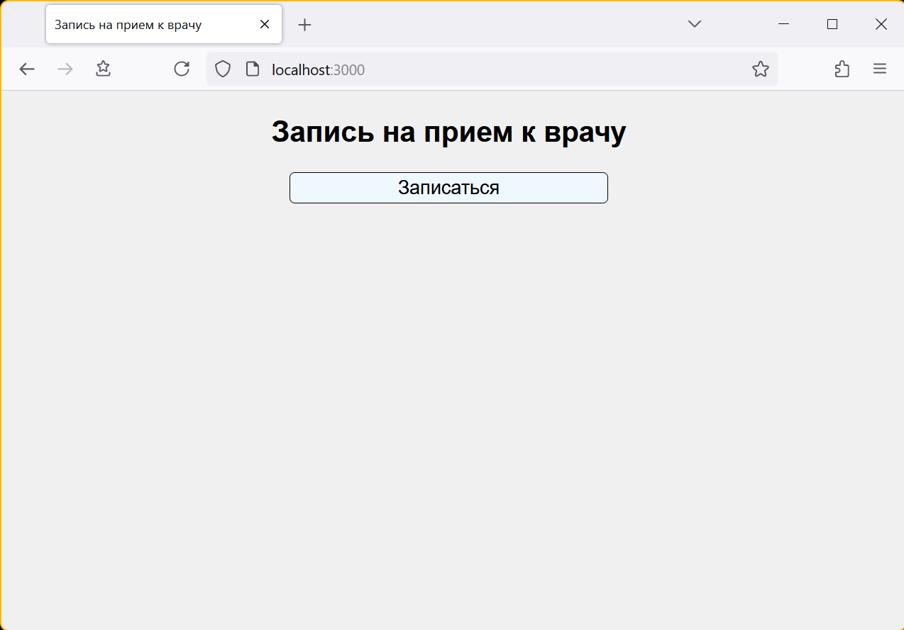
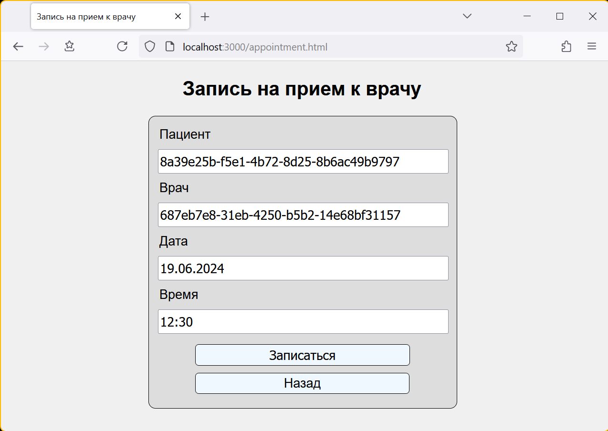
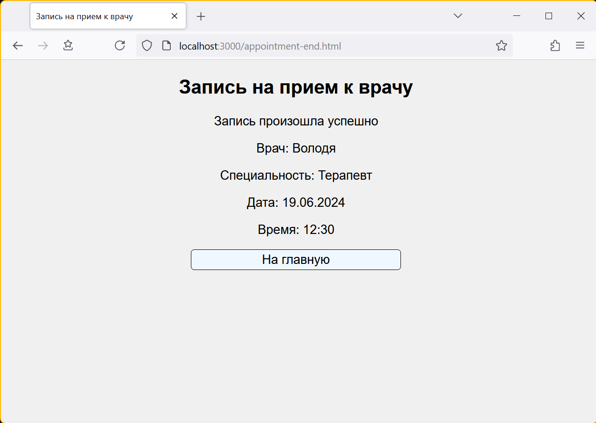
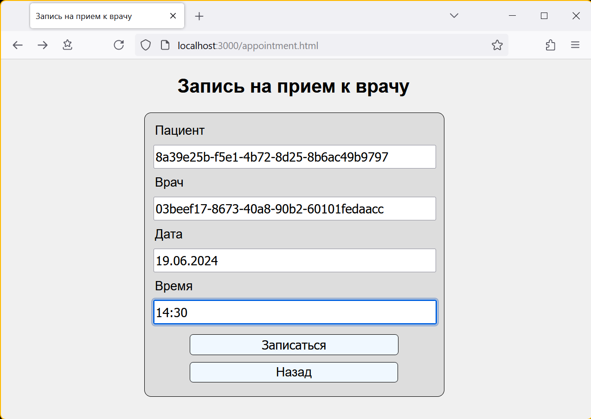
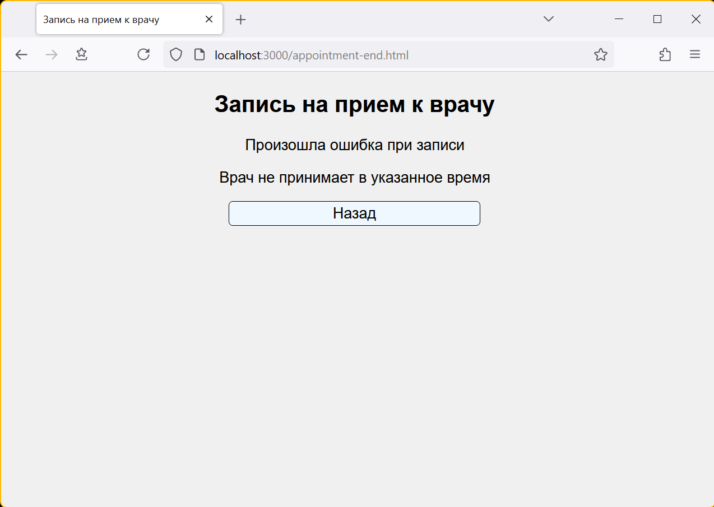
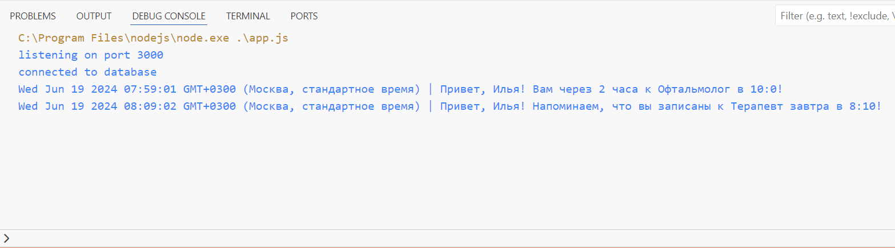

## Лабораторная работа №4

[Задание](https://gist.github.com/babysharny/3778b6b64180d87ac7138f9c8aeabf43)

### Инструменты

Фреймворк - `Koa.js`

База данных - `MongoDB`

### Инструкции

#### Установка

`npm install`

#### Предзаполнение БД

`npm run prefill`

Предзаполненные UUID
<details>
<summary>Тыц</summary>

Пациенты:
```
ab71d2e0-a475-41d9-b68f-d7999d4250f2
e2a4c459-8090-4a48-843b-a8f8fb33a528
8a39e25b-f5e1-4b72-8d25-8b6ac49b9797
```
Доктора:
```
687eb7e8-31eb-4250-b5b2-14e68bf31157
03beef17-8673-40a8-90b2-60101fedaacc
```
</details>
</br>
Временные слоты заполняются на 3 дня вперед от текущей даты. Время – с 8:00 до 13:00 с интервалом 10-15 минут (в зависимости от доктора)

#### Запуск

`npm start`

### Скриншоты

<details>
<summary>Тыц</summary>

Стартовый экран


Пример успешной записи



Пример попытки записи на занятый слот


Пример попытки записи на несуществующее время



Уведомления о приеме

</details>

### Ответы на вопросы

#### 1. Какие есть виды и типы баз данных с примерами?
* Реляционные (MySQL, PostgreSQL, SQLite, Microsoft SQL)
* Ключ-значение (Redis, Amazon DynamoDB)
* Документо-ориентированные (MongoDB, Azure Cosmos DB)
* Базы данных временных рядов (InfluxDB, Prometheus)
* Графовые (Neo4j, GraphDB, Neptune, AllegroGraph)
* Объектно-ориентированные (Objectivity/DB, Perst, ZODB, db4o)
* Колоночные (Bigtable, Apache Cassandra)
* Векторные (Pinecone, Chroma, Milvus)
* Мультимодальные (ArangoDB, Azure Cosmos DB, OrientDB)

Нереляционные базы данных имеют общее обозначение NoSQL (non-SQL, иногда Not only SQL)

#### 2. В чём различие между Web-сервером и оболочкой, такой как, например, NodeJS?
Веб-сервер — сервер, принимающий HTTP-запросы от клиентов, обычно веб-браузеров, и выдающий им HTTP-ответы, как правило, вместе с HTML-страницей, изображением, файлом, медиа-потоком или другими данными. Веб-сервером называют как программное обеспечение, выполняющее функции веб-сервера, так и непосредственно компьютер, на котором это программное обеспечение работает.

Оболочки, такие как Node.JS, служат для разработки приложений. Они обеспечивают взаимодействие с устройствами ввода-вывода через свой API, позволяют подключать другие внешние библиотеки, написанные на разных языках, обеспечивая вызовы к ним. Оболочки позволяют разрабатывать как оконные приложения, так и приложения, выполняющие роль веб-сервера.

#### 3. По какому API соединяются фреймворк и база данных в данном задании?
Для соединения базы данных и JS-фреймворка используется ODM (Object-Document Mapping) библиотека `Mongoose`. Она позволяет связать типы документов, хранящихся в базе данных, с классами web-приложения, что делает более удобным оперирование данными на уровне приложения.
